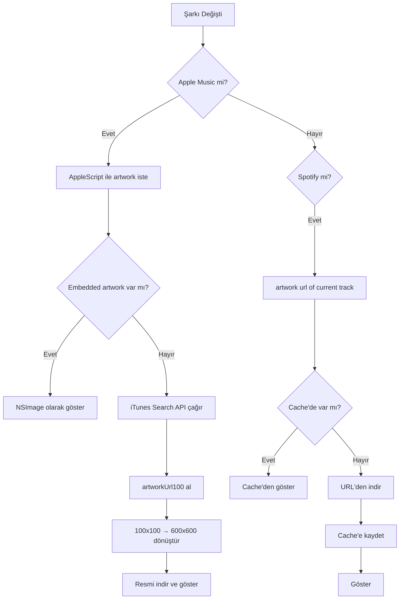

# MusicPlayer - Kapsamlı Teknik Dokümantasyon

Bu dokümantasyon, macOS Menu Bar müzik kontrol uygulamasının nasıl oluşturulduğunu detaylı şekilde açıklar. Gelecekte benzer uygulamalar geliştirmek için referans olarak kullanılabilir.

---

## İçindekiler

1. [Proje Yapısı](#proje-yapısı)
2. [Kullanılan Apple Teknolojileri](#kullanılan-apple-teknolojileri)
3. [Info.plist Yapılandırması](#infoplist-yapılandırması)
4. [Entitlements (Yetkilendirmeler)](#entitlements-yetkilendirmeler)
5. [Uygulama Mimarisi](#uygulama-mimarisi)
6. [Kaynak Kodlar](#kaynak-kodlar)
7. [AppleScript Detayları](#applescript-detayları)
8. [Artwork Yükleme Stratejisi](#artwork-yükleme-stratejisi)
9. [Xcode Yapılandırması](#xcode-yapılandırması)
10. [Sorun Giderme](#sorun-giderme)

---

## Proje Yapısı

```
MusicPlayer/
├── MusicPlayer.xcodeproj
└── MusicPlayer/
    ├── MusicPlayerApp.swift      # Ana giriş noktası, MenuBarExtra
    ├── MusicService.swift        # Backend mantığı, AppleScript
    ├── PlayerView.swift          # SwiftUI kullanıcı arayüzü
    ├── PermissionManager.swift   # İzin isteme yönetimi
    ├── Info.plist                # Gizlilik açıklamaları
    ├── MusicPlayer.entitlements  # Sandbox yetkilendirmeleri
    └── Assets.xcassets/          # Uygulama ikonları
```

---

## Kullanılan Apple Teknolojileri

| Teknoloji | Amaç | Framework |
|-----------|------|-----------|
| **MenuBarExtra** | Menu Bar'da uygulama gösterme | SwiftUI (macOS 13+) |
| **@Observable** | Reaktif veri bağlama | Observation (macOS 14+) |
| **NSAppleScript** | Diğer uygulamalarla iletişim | Foundation |
| **NSWorkspace** | Çalışan uygulamaları tespit etme | AppKit |
| **URLSession** | HTTP istekleri (iTunes API, Spotify artwork) | Foundation |
| **Timer** | Periyodik güncelleme (polling) | Foundation |
| **App Sandbox** | Güvenli uygulama izolasyonu | Security |

### Neden Bu Teknolojiler?

```mermaid
graph TD
    A[App Store Uyumluluğu] --> B{Private API Kullanımı}
    B -->|Hayır| C[NSAppleScript ✓]
    B -->|Evet| D[MediaRemote ✗]
    
    E[Modern macOS] --> F[MenuBarExtra macOS 13+]
    E --> G[@Observable macOS 14+]
    
    H[Sandbox Gereksinimleri] --> I[Entitlements ile Yetkilendirme]
```

---

## Info.plist Yapılandırması

Info.plist, uygulamanın sistem izinleri istemeden önce kullanıcıya göstereceği açıklamaları içerir.

### Dosya İçeriği

```xml
<?xml version="1.0" encoding="UTF-8"?>
<!DOCTYPE plist PUBLIC "-//Apple//DTD PLIST 1.0//EN" 
  "http://www.apple.com/DTDs/PropertyList-1.0.dtd">
<plist version="1.0">
<dict>
    <key>NSAppleEventsUsageDescription</key>
    <string>MusicPlayer needs to control Apple Music and Spotify 
      for playback features.</string>
</dict>
</plist>
```

### Anahtar Açıklaması

| Anahtar | Zorunlu | Açıklama |
|---------|---------|----------|
| `NSAppleEventsUsageDescription` | **Evet** | AppleScript/Apple Events kullanımı için gerekli. Bu olmadan uygulama sessizce başarısız olur. |

> [!IMPORTANT]
> Bu anahtar olmadan macOS izin dialogu GÖSTERMEZ ve AppleScript çağrıları sessizce başarısız olur!

### Xcode'da Ekleme

1. Project Navigator'da proje dosyasını seç
2. **Info** sekmesine git
3. **Custom macOS Application Target Properties** altında **+** butonuna tıkla
4. `Privacy - AppleEvents Sending Usage Description` seç
5. Değer olarak açıklama metnini yaz

---

## Entitlements (Yetkilendirmeler)

Entitlements, App Sandbox içinde uygulamanın hangi kaynaklara erişebileceğini belirler.

### Dosya İçeriği

```xml
<?xml version="1.0" encoding="UTF-8"?>
<!DOCTYPE plist PUBLIC "-//Apple//DTD PLIST 1.0//EN" 
  "http://www.apple.com/DTDs/PropertyList-1.0.dtd">
<plist version="1.0">
<dict>
    <key>com.apple.security.app-sandbox</key>
    <true/>
    
    <key>com.apple.security.automation.apple-events</key>
    <true/>
    
    <key>com.apple.security.files.user-selected.read-write</key>
    <true/>
    
    <key>com.apple.security.network.client</key>
    <true/>
    
    <key>com.apple.security.temporary-exception.apple-events</key>
    <array>
        <string>com.apple.Music</string>
        <string>com.spotify.client</string>
        <string>com.apple.systemevents</string>
    </array>
</dict>
</plist>
```

### Entitlement Detayları

| Entitlement | Değer | Amaç |
|-------------|-------|------|
| `app-sandbox` | `true` | App Store için zorunlu sandbox |
| `automation.apple-events` | `true` | AppleScript çalıştırma izni |
| `files.user-selected.read-write` | `true` | Dosya okuma/yazma (opsiyonel) |
| `network.client` | `true` | İnternet bağlantısı (iTunes API için) |
| `temporary-exception.apple-events` | Array | Hangi uygulamalara AppleScript gönderebileceği |

### Bundle Identifier'lar

| Uygulama | Bundle Identifier |
|----------|-------------------|
| Apple Music | `com.apple.Music` |
| Spotify | `com.spotify.client` |
| System Events | `com.apple.systemevents` |

> [!WARNING]
> `temporary-exception.apple-events` olmadan AppleScript hedef uygulamaya gönderilEMEZ!

---

## Uygulama Mimarisi

```mermaid
graph TB
    subgraph "Uygulama Katmanları"
        A[MusicPlayerApp.swift] --> B[MenuBarExtra]
        B --> C[PlayerView.swift]
        C --> D[MusicService.swift]
    end
    
    subgraph "Dış Kaynaklar"
        D --> E[NSAppleScript]
        E --> F[Apple Music]
        E --> G[Spotify]
        E --> H[System Events]
        D --> I[iTunes Search API]
        D --> J[Spotify CDN]
    end
    
    subgraph "Veri Akışı"
        K[Timer 1s] --> D
        D --> L[@Observable]
        L --> C
    end
```

### Katman Sorumlulukları

| Katman | Dosya | Sorumluluk |
|--------|-------|------------|
| **App Entry** | MusicPlayerApp.swift | MenuBarExtra oluşturma, izinleri tetikleme |
| **UI** | PlayerView.swift | Görsel arayüz, kullanıcı etkileşimleri |
| **Service** | MusicService.swift | AppleScript çalıştırma, veri işleme |
| **Permission** | PermissionManager.swift | İlk çalıştırmada izin dialoglarını tetikleme |

---

## Kaynak Kodlar

### 1. MusicPlayerApp.swift

Ana giriş noktası. MenuBarExtra oluşturur ve izin yöneticisini başlatır.

```swift
import SwiftUI

@main
struct MusicPlayerApp: App {
    @State private var musicService = MusicService()
    
    init() {
        PermissionManager.shared.requestPermissionsOnLaunch()
    }
    
    var body: some Scene {
        MenuBarExtra {
            PlayerView(musicService: musicService)
        } label: {
            Image(systemName: "music.note")
        }
        .menuBarExtraStyle(.window)
    }
}
```

**Önemli Noktalar:**
- `@main` - Uygulamanın giriş noktası
- `@State` - MusicService'i saklayıp UI'a bağlar
- `MenuBarExtra` - macOS 13+ menu bar API'si
- `.menuBarExtraStyle(.window)` - Popover yerine window stili

---

### 2. PermissionManager.swift

İlk çalıştırmada izin dialoglarını tetikler.

```swift
import AppKit
import Foundation

final class PermissionManager {
    static let shared = PermissionManager()
    
    private init() {}
    
    func requestPermissionsOnLaunch() {
        DispatchQueue.global(qos: .userInitiated).async {
            self.triggerAppleMusicPermission()
            self.triggerSpotifyPermission()
        }
    }
    
    private func triggerAppleMusicPermission() {
        let script = """
        tell application "System Events"
            return name of first process whose bundle identifier is "com.apple.Music"
        end tell
        """
        var error: NSDictionary?
        let appleScript = NSAppleScript(source: script)
        appleScript?.executeAndReturnError(&error)
    }
    
    private func triggerSpotifyPermission() {
        let script = """
        tell application "System Events"
            return name of first process whose bundle identifier is "com.spotify.client"
        end tell
        """
        var error: NSDictionary?
        let appleScript = NSAppleScript(source: script)
        appleScript?.executeAndReturnError(&error)
    }
}
```

**Neden System Events?**
- `System Events`'e AppleScript göndermek, macOS'un izin dialogu göstermesini tetikler
- Gerçek müzik uygulamasına göndermeden önce izin alınmış olur

---

### 3. MusicService.swift

Uygulamanın beyni. Tüm AppleScript iletişimini ve veri işlemeyi yönetir.

```swift
import AppKit
import Combine
import Foundation

enum MusicApp: String {
    case appleMusic = "com.apple.Music"
    case spotify = "com.spotify.client"
}

@Observable
final class MusicService {
    // MARK: - Public Properties (UI'a bağlı)
    var isPlaying: Bool = false
    var trackName: String = ""
    var artistName: String = ""
    var albumName: String = ""
    var artwork: NSImage?
    var activeApp: MusicApp?
    var currentPosition: Double = 0
    var duration: Double = 0
    
    // MARK: - Private Properties
    private var timer: Timer?
    private var artworkCache: [String: NSImage] = [:]
    private var lastTrackName: String = ""
    
    // MARK: - Lifecycle
    init() {
        startPolling()
    }
    
    deinit {
        timer?.invalidate()
    }
    
    // MARK: - Polling
    func startPolling() {
        timer?.invalidate()
        timer = Timer.scheduledTimer(withTimeInterval: 1.0, repeats: true) { [weak self] _ in
            self?.updateNowPlaying()
        }
        timer?.tolerance = 0.2  // Pil tasarrufu için tolerans
        updateNowPlaying()
    }
    
    func stopPolling() {
        timer?.invalidate()
        timer = nil
    }
    
    // MARK: - Playback Controls
    func playPause() {
        guard let app = activeApp else { return }
        switch app {
        case .appleMusic:
            executeAppleScript("tell application \"Music\" to playpause")
        case .spotify:
            executeAppleScript("tell application \"Spotify\" to playpause")
        }
        DispatchQueue.main.asyncAfter(deadline: .now() + 0.1) { [weak self] in
            self?.updateNowPlaying()
        }
    }
    
    func nextTrack() {
        guard let app = activeApp else { return }
        switch app {
        case .appleMusic:
            executeAppleScript("tell application \"Music\" to next track")
        case .spotify:
            executeAppleScript("tell application \"Spotify\" to next track")
        }
        DispatchQueue.main.asyncAfter(deadline: .now() + 0.3) { [weak self] in
            self?.updateNowPlaying()
        }
    }
    
    func previousTrack() {
        guard let app = activeApp else { return }
        switch app {
        case .appleMusic:
            executeAppleScript("tell application \"Music\" to previous track")
        case .spotify:
            executeAppleScript("tell application \"Spotify\" to previous track")
        }
        DispatchQueue.main.asyncAfter(deadline: .now() + 0.3) { [weak self] in
            self?.updateNowPlaying()
        }
    }
    
    func seek(to position: Double) {
        guard let app = activeApp else { return }
        let posInt = Int(position)
        switch app {
        case .appleMusic:
            executeAppleScript("tell application \"Music\" to set player position to \(posInt)")
        case .spotify:
            executeAppleScript("tell application \"Spotify\" to set player position to \(posInt)")
        }
    }
    
    // MARK: - Update Logic
    private func updateNowPlaying() {
        DispatchQueue.global(qos: .userInitiated).async { [weak self] in
            guard let self else { return }
            
            // Önce Apple Music kontrol et
            if self.isAppRunning(.appleMusic) {
                if let info = self.getAppleMusicTrackInfo() {
                    let (position, dur) = self.getAppleMusicPosition()
                    let trackChanged = self.lastTrackName != info.track
                    DispatchQueue.main.async {
                        self.activeApp = .appleMusic
                        self.isPlaying = info.isPlaying
                        self.trackName = info.track
                        self.artistName = info.artist
                        self.albumName = info.album
                        self.currentPosition = position
                        self.duration = dur
                        if trackChanged {
                            self.lastTrackName = info.track
                            self.loadAppleMusicArtwork()
                        }
                    }
                    return
                }
            }
            
            // Sonra Spotify kontrol et
            if self.isAppRunning(.spotify) {
                if let info = self.getSpotifyTrackInfo() {
                    let (position, dur) = self.getSpotifyPosition()
                    let trackChanged = self.lastTrackName != info.track
                    DispatchQueue.main.async {
                        self.activeApp = .spotify
                        self.isPlaying = info.isPlaying
                        self.trackName = info.track
                        self.artistName = info.artist
                        self.albumName = info.album
                        self.currentPosition = position
                        self.duration = dur
                        if trackChanged {
                            self.lastTrackName = info.track
                            if let url = info.artworkURL {
                                self.loadSpotifyArtwork(from: url)
                            }
                        }
                    }
                    return
                }
            }
            
            // Hiçbir uygulama çalmıyor
            DispatchQueue.main.async {
                self.activeApp = nil
                self.isPlaying = false
                self.trackName = ""
                self.artistName = ""
                self.albumName = ""
                self.artwork = nil
                self.currentPosition = 0
                self.duration = 0
                self.lastTrackName = ""
            }
        }
    }
    
    // MARK: - App Detection
    private func isAppRunning(_ app: MusicApp) -> Bool {
        NSWorkspace.shared.runningApplications.contains { 
            $0.bundleIdentifier == app.rawValue 
        }
    }
    
    // MARK: - Apple Music AppleScript
    private func getAppleMusicTrackInfo() -> (isPlaying: Bool, track: String, 
                                               artist: String, album: String)? {
        let script = """
        tell application "Music"
            if player state is playing then
                set playerState to "playing"
            else
                set playerState to "paused"
            end if
            try
                set trackName to name of current track
                set trackArtist to artist of current track
                set trackAlbum to album of current track
                return playerState & "|" & trackName & "|" & trackArtist & "|" & trackAlbum
            on error
                return ""
            end try
        end tell
        """
        
        guard let result = executeAppleScript(script), !result.isEmpty else { return nil }
        let parts = result.components(separatedBy: "|")
        guard parts.count >= 4 else { return nil }
        
        let isPlaying = parts[0] == "playing"
        let track = parts[1]
        let artist = parts[2]
        let album = parts[3]
        
        guard !track.isEmpty else { return nil }
        return (isPlaying, track, artist, album)
    }
    
    private func getAppleMusicPosition() -> (position: Double, duration: Double) {
        let posScript = "tell application \"Music\" to return player position"
        let durScript = "tell application \"Music\" to return duration of current track"
        
        let posResult = executeAppleScript(posScript) ?? "0"
        let durResult = executeAppleScript(durScript) ?? "0"
        
        let position = parseDouble(posResult)
        let duration = parseDouble(durResult)
        
        return (position, duration)
    }
    
    // MARK: - Spotify AppleScript
    private func getSpotifyTrackInfo() -> (isPlaying: Bool, track: String, 
                                            artist: String, album: String, 
                                            artworkURL: String?)? {
        let script = """
        tell application "Spotify"
            if player state is playing then
                set playerState to "playing"
            else
                set playerState to "paused"
            end if
            try
                set trackName to name of current track
                set trackArtist to artist of current track
                set trackAlbum to album of current track
                set artURL to artwork url of current track
                return playerState & "|" & trackName & "|" & trackArtist & "|" & trackAlbum & "|" & artURL
            on error
                return ""
            end try
        end tell
        """
        
        guard let result = executeAppleScript(script), !result.isEmpty else { return nil }
        let parts = result.components(separatedBy: "|")
        guard parts.count >= 5 else { return nil }
        
        let isPlaying = parts[0] == "playing"
        let track = parts[1]
        let artist = parts[2]
        let album = parts[3]
        let artworkURL = parts[4].isEmpty ? nil : parts[4]
        
        guard !track.isEmpty else { return nil }
        return (isPlaying, track, artist, album, artworkURL)
    }
    
    private func getSpotifyPosition() -> (position: Double, duration: Double) {
        let posScript = "tell application \"Spotify\" to return player position"
        // Spotify süreyi milisaniye cinsinden döndürür
        let durScript = "tell application \"Spotify\" to return (duration of current track) / 1000"
        
        let posResult = executeAppleScript(posScript) ?? "0"
        let durResult = executeAppleScript(durScript) ?? "0"
        
        let position = parseDouble(posResult)
        let duration = parseDouble(durResult)
        
        return (position, duration)
    }
    
    // MARK: - Locale Handling
    private func parseDouble(_ string: String) -> Double {
        // Türkçe locale'de ondalık ayracı virgül olabilir
        let cleaned = string.replacingOccurrences(of: ",", with: ".")
        return Double(cleaned) ?? 0
    }
    
    // MARK: - Artwork Loading
    private func loadAppleMusicArtwork() {
        let artist = self.artistName
        let album = self.albumName
        
        DispatchQueue.global(qos: .userInitiated).async { [weak self] in
            guard let self else { return }
            
            // Önce embedded artwork dene
            let script = """
            tell application "Music"
                try
                    set theTrack to current track
                    set artworkCount to count of artworks of theTrack
                    if artworkCount > 0 then
                        return data of artwork 1 of theTrack
                    else
                        return ""
                    end if
                on error
                    return ""
                end try
            end tell
            """
            
            var error: NSDictionary?
            guard let appleScript = NSAppleScript(source: script) else {
                self.fetchArtworkFromiTunes(artist: artist, album: album)
                return
            }
            let result = appleScript.executeAndReturnError(&error)
            
            let imageData = result.data
            if imageData.count > 0, let image = NSImage(data: imageData) {
                DispatchQueue.main.async {
                    self.artwork = image
                }
            } else {
                // Embedded artwork yoksa iTunes API'den al
                self.fetchArtworkFromiTunes(artist: artist, album: album)
            }
        }
    }
    
    private func fetchArtworkFromiTunes(artist: String, album: String) {
        let searchTerm = "\(artist) \(album)"
            .addingPercentEncoding(withAllowedCharacters: .urlQueryAllowed) ?? ""
        let urlString = "https://itunes.apple.com/search?term=\(searchTerm)&media=music&entity=album&limit=1"
        
        guard let url = URL(string: urlString) else { return }
        
        URLSession.shared.dataTask(with: url) { [weak self] data, _, _ in
            guard let self, let data else { return }
            
            do {
                if let json = try JSONSerialization.jsonObject(with: data) as? [String: Any],
                   let results = json["results"] as? [[String: Any]],
                   let firstResult = results.first,
                   let artworkUrl = firstResult["artworkUrl100"] as? String {
                    
                    // 100x100'ü 600x600'e çevir
                    let highResUrl = artworkUrl.replacingOccurrences(of: "100x100", with: "600x600")
                    
                    if let imageUrl = URL(string: highResUrl) {
                        URLSession.shared.dataTask(with: imageUrl) { [weak self] imgData, _, _ in
                            guard let self, let imgData, 
                                  let image = NSImage(data: imgData) else { return }
                            DispatchQueue.main.async {
                                self.artwork = image
                            }
                        }.resume()
                    }
                }
            } catch {}
        }.resume()
    }
    
    private func loadSpotifyArtwork(from urlString: String) {
        let cacheKey = urlString
        if let cached = artworkCache[cacheKey] {
            self.artwork = cached
            return
        }
        
        guard let url = URL(string: urlString) else { return }
        
        URLSession.shared.dataTask(with: url) { [weak self] data, _, _ in
            guard let self, let data, let image = NSImage(data: data) else { return }
            DispatchQueue.main.async {
                self.artworkCache[cacheKey] = image
                self.artwork = image
            }
        }.resume()
    }
    
    // MARK: - AppleScript Execution
    @discardableResult
    private func executeAppleScript(_ source: String) -> String? {
        var error: NSDictionary?
        let script = NSAppleScript(source: source)
        let result = script?.executeAndReturnError(&error)
        return result?.stringValue
    }
}
```

---

### 4. PlayerView.swift

SwiftUI kullanıcı arayüzü.

```swift
import SwiftUI

struct PlayerView: View {
    @Bindable var musicService: MusicService
    @State private var isSeeking: Bool = false
    @State private var seekPosition: Double = 0
    
    var body: some View {
        VStack(spacing: 16) {
            if musicService.activeApp != nil {
                artworkView
                trackInfoView
                progressView
                controlsView
            } else {
                emptyStateView
            }
        }
        .padding(20)
        .frame(width: 280)
        .background(.ultraThinMaterial)
    }
    
    private var artworkView: some View {
        Group {
            if let artwork = musicService.artwork {
                Image(nsImage: artwork)
                    .resizable()
                    .aspectRatio(contentMode: .fill)
                    .frame(width: 200, height: 200)
                    .clipShape(RoundedRectangle(cornerRadius: 12))
                    .shadow(color: .black.opacity(0.3), radius: 10, y: 5)
            } else {
                RoundedRectangle(cornerRadius: 12)
                    .fill(.quaternary)
                    .frame(width: 200, height: 200)
                    .overlay {
                        Image(systemName: "music.note")
                            .font(.system(size: 48))
                            .foregroundStyle(.secondary)
                    }
            }
        }
    }
    
    private var trackInfoView: some View {
        VStack(spacing: 4) {
            Text(musicService.trackName)
                .font(.headline)
                .fontWeight(.semibold)
                .lineLimit(1)
                .truncationMode(.tail)
            
            Text(musicService.artistName)
                .font(.subheadline)
                .foregroundStyle(.secondary)
                .lineLimit(1)
                .truncationMode(.tail)
        }
        .frame(maxWidth: .infinity)
    }
    
    private var progressView: some View {
        VStack(spacing: 4) {
            Slider(
                value: isSeeking ? $seekPosition : .constant(musicService.currentPosition),
                in: 0...max(musicService.duration, 1),
                onEditingChanged: { editing in
                    if editing {
                        isSeeking = true
                        seekPosition = musicService.currentPosition
                    } else {
                        musicService.seek(to: seekPosition)
                        isSeeking = false
                    }
                }
            )
            .tint(.primary)
            
            HStack {
                Text(formatTime(isSeeking ? seekPosition : musicService.currentPosition))
                    .font(.caption)
                    .foregroundStyle(.secondary)
                    .monospacedDigit()
                
                Spacer()
                
                Text(formatTime(musicService.duration))
                    .font(.caption)
                    .foregroundStyle(.secondary)
                    .monospacedDigit()
            }
        }
    }
    
    private var controlsView: some View {
        HStack(spacing: 32) {
            Button(action: { musicService.previousTrack() }) {
                Image(systemName: "backward.fill")
                    .font(.title2)
            }
            .buttonStyle(.plain)
            .contentShape(Rectangle())
            
            Button(action: { musicService.playPause() }) {
                Image(systemName: musicService.isPlaying ? "pause.circle.fill" : "play.circle.fill")
                    .font(.system(size: 44))
            }
            .buttonStyle(.plain)
            .contentShape(Rectangle())
            
            Button(action: { musicService.nextTrack() }) {
                Image(systemName: "forward.fill")
                    .font(.title2)
            }
            .buttonStyle(.plain)
            .contentShape(Rectangle())
        }
        .foregroundStyle(.primary)
    }
    
    private var emptyStateView: some View {
        VStack(spacing: 12) {
            Image(systemName: "music.note.list")
                .font(.system(size: 40))
                .foregroundStyle(.tertiary)
            
            Text("Not Playing")
                .font(.headline)
                .foregroundStyle(.secondary)
            
            Text("Open Apple Music or Spotify\nto control playback")
                .font(.caption)
                .foregroundStyle(.tertiary)
                .multilineTextAlignment(.center)
        }
        .frame(height: 200)
    }
    
    private func formatTime(_ seconds: Double) -> String {
        let mins = Int(seconds) / 60
        let secs = Int(seconds) % 60
        return String(format: "%d:%02d", mins, secs)
    }
}
```

---

## AppleScript Detayları

### Apple Music Komutları

| Komut | AppleScript | Açıklama |
|-------|-------------|----------|
| Oynat/Duraklat | `tell application "Music" to playpause` | Toggle |
| Sonraki | `tell application "Music" to next track` | - |
| Önceki | `tell application "Music" to previous track` | - |
| Şarkı Adı | `name of current track` | String |
| Sanatçı | `artist of current track` | String |
| Albüm | `album of current track` | String |
| Konum | `player position` | Saniye (Double) |
| Süre | `duration of current track` | Saniye (Double) |
| Durum | `player state` | `playing`, `paused`, `stopped` |
| Artwork | `data of artwork 1 of current track` | Raw data |

### Spotify Komutları

| Komut | AppleScript | Fark |
|-------|-------------|------|
| Süre | `(duration of current track) / 1000` | **Milisaniye** cinsinden, 1000'e böl |
| Artwork URL | `artwork url of current track` | URL string döner, indirmek gerek |

---

## Artwork Yükleme Stratejisi



### iTunes Search API

```
GET https://itunes.apple.com/search?term={artist}+{album}&media=music&entity=album&limit=1
```

**Örnek Yanıt:**
```json
{
  "results": [{
    "artworkUrl100": "https://...100x100bb.jpg"
  }]
}
```

**Yüksek Çözünürlük:** `100x100` → `600x600` string replace

---

## Xcode Yapılandırması

### Build Settings

| Ayar | Değer | Nerede |
|------|-------|--------|
| Info.plist File | `MusicPlayer/Info.plist` | Build Settings → Packaging |
| Code Signing Entitlements | `MusicPlayer/MusicPlayer.entitlements` | Build Settings → Signing |
| Deployment Target | macOS 14.0+ | General → Minimum Deployments |

### Dosyaları Projeye Ekleme

Info.plist ve .entitlements dosyaları **Copy Bundle Resources**'a EKLENMEMELİ!

1. Xcode'da proje navigator'da dosyaya tıkla
2. Target Membership'te checkbox'ı kaldır (sadece Build Settings'te referans olmalı)

---

## Sorun Giderme

### İzin İstenmiyor

| Kontrol | Çözüm |
|---------|-------|
| Info.plist'te `NSAppleEventsUsageDescription` var mı? | Ekle |
| Entitlements bağlı mı? | Build Settings kontrol et |
| Entitlements'ta hedef bundle ID'ler var mı? | `temporary-exception.apple-events` kontrol et |

### AppleScript Çalışmıyor

```bash
# Terminal'de test et
osascript -e 'tell application "Music" to return name of current track'
```

### Artwork Yüklenmiyor

1. Şarkıda embedded artwork var mı kontrol et:
```bash
osascript -e 'tell application "Music" to return count of artworks of current track'
```

2. iTunes API çalışıyor mu kontrol et:
```bash
curl "https://itunes.apple.com/search?term=artist+album&entity=album&limit=1"
```

### Türkçe Locale Sorunu

Ondalık sayılar `3,14` yerine `3.14` olmalı. `parseDouble` fonksiyonu bunu hallediyor.

---

## Prompt Şablonu (Benzer Uygulama İçin)

Başka bir uygulamada benzer özellik istediğinizde:

```
[Uygulama adı] projesine [hedef uygulama] kontrolü eklemek istiyorum.

Gereksinimler:
1. NSAppleScript kullanarak [hedef] uygulamasını kontrol et
2. App Sandbox uyumlu olsun (App Store için)
3. İzinleri ilk açılışta iste
4. [özel gereksinimler]

Lütfen:
1. Info.plist için gerekli anahtarları oluştur
2. Entitlements dosyasını yapılandır (bundle ID: [hedef bundle id])
3. AppleScript servis sınıfı oluştur
4. SwiftUI view oluştur

NOT: MusicPlayer projesindeki yaklaşımı referans al.
```

---

## Özet

Bu uygulama şu temel prensipleri izler:

1. **App Store Uyumluluğu** - Private API kullanmadan, sadece AppleScript
2. **Sandbox Güvenliği** - Entitlements ile kontrollü erişim
3. **Reactive UI** - @Observable ile otomatik güncelleme
4. **Graceful Degradation** - Artwork yoksa iTunes API fallback
5. **Locale Awareness** - Türkçe ondalık ayracı desteği
